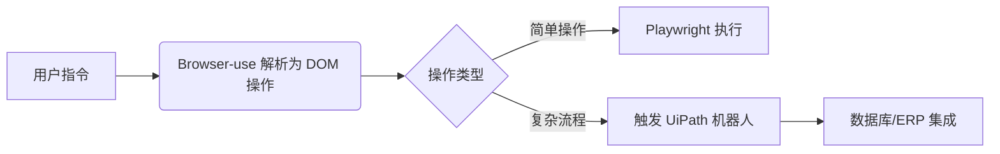

UiPath 和 Browser-use 是两种定位不同、适用场景差异显著的自动化工具，理解它们的核心区别对于技术选型至关重要：

---

### 🧠 **一、本质定位差异**
| **维度**       | **UiPath**                              | **Browser-use**                          |
|----------------|-----------------------------------------|------------------------------------------|
| **类型**       | 企业级 RPA 平台                         | 轻量级 Web 自动化 JavaScript 库          |
| **架构**       | 桌面客户端 + 云端控制台                 | 纯前端库，依赖浏览器环境                 |
| **开发语言**   | C#/VB.NET（活动开发）、可视化设计器     | JavaScript/TypeScript                    |
| **部署方式**   | Windows 服务、机器人集群                | 浏览器扩展或网页脚本注入                 |

---

### ⚙️ **二、核心能力对比**
#### **UiPath：企业级浏览器自动化** 
- **多浏览器支持**  
  通过 `Open Browser` 或 `Use Application/Browser` 活动原生控制 Chrome、Edge、Firefox 等，支持自定义 Chromium 内核浏览器（需配置 `--remote-debugging-port`）。
- **工业级稳定性**  
  提供异常处理（如 `Try-Catch` 和 `Throw` 活动）、重试机制、超时控制，确保流程抗干扰能力。
- **复杂操作封装**  
  - 元素定位：支持 XPath/CSS 选择器、图像识别、OCR 文本匹配  
  - 数据抓取：内置 `Data Scraping` 向导，自动提取表格/列表数据  
  - 跨应用集成：可联动 Excel、数据库、API 调用等后端系统
- **企业级特性**  
  审计日志、权限管理、机器人调度（需 Automation Cloud 或 Orchestrator）。

#### **Browser-use：轻量级网页交互增强** 
- **DOM 智能标注**  
  通过递归遍历生成可操作元素树，将自然语言指令（如“点击登录按钮”）映射为 Playwright 操作。
- **无头浏览器协同**  
  依赖 Playwright/Puppeteer 执行实际操作，自身专注**意图解析**与**元素映射**。
- **前端友好集成**  
  可直接嵌入 React/Vue 项目，示例代码：
  ```javascript
  import { highlightElement } from 'browser-use';
  // 标注页面中所有可点击元素
  highlightElement({ action: 'click' }); 
  ```

---

### 🌐 **三、典型使用场景**
#### **UiPath：适合重型自动化流程** 
- **跨系统数据同步**  
  例如从电商网站抓取价格 → 写入 Excel → 邮件发送报表。
- **企业后台处理**  
  银行账单审核（OCR 识别表格 → 逻辑校验 → ERP 录入）。
- **合规性检查**  
  自动扫描企业官网所有链接有效性（结合 HTTP 状态码检测）。
- **生成式 AI 集成**  
  调用 GPT 处理客服邮件，自动生成回复草案。

#### **Browser-use：适合轻量级用户辅助** 
- **浏览器扩展开发**  
  为个人开发者提供快速实现“智能填表”、“一键比价”等功能的 SDK。
- **交互式演示工具**  
  教学场景中高亮并自动操作页面元素。
- **低代码自动化原型**  
  快速验证网页自动化可行性，无需部署 RPA 环境。

---

### 🛠️ **四、开发与部署成本**
| **环节**       | **UiPath**                              | **Browser-use**                          |
|----------------|-----------------------------------------|------------------------------------------|
| 学习曲线       | 需掌握活动库、选取器语法、.NET 基础     | 前端开发者可直接上手，文档简洁           |
| 部署复杂度     | 需安装 Studio、机器人运行时             | `npm install browser-use` 即用           |
| 定制开发       | 需用 C# 编写自定义活动（生成 DLL） | 直接修改 JS/TS 源码                      |
| 硬件要求       | Windows 服务器 + 虚拟机资源             | 仅需现代浏览器                           |

---

### 💡 **五、混合使用建议**
在实际项目中，两者可互补：
1. **前端交互层**：用 Browser-use 实现网页元素智能标注与用户意图解析  
2. **后端流程层**：通过 UiPath 调用处理结果，执行跨系统持久化操作  

示例架构：


---

### 💎 **总结：按场景选择工具**
- 选 **UiPath** 若：  
  ✅ 需自动化**跨桌面应用+浏览器**的复杂流程  
  ✅ 企业环境要求**审计日志**与**故障恢复**  
  ✅ 已有 .NET 技术栈（例：用 C# 扩展自定义活动）  

- 选 **Browser-use** 若：  
  ✅ 快速为**现有网页添加智能辅助功能**  
  ✅ 个人开发者追求**零部署成本**  
  ✅ 技术栈基于 **JavaScript/Electron**（如 AI 浏览器开发）  

> 两者本质解决不同层级问题：UiPath 是**自动化流水线工厂**，Browser-use 是**网页操作智能手套**。轻量前端交互优先用 Browser-use 快速原型；若需深度整合本地文件/跨应用操作，再引入 UiPath 作为后端引擎。