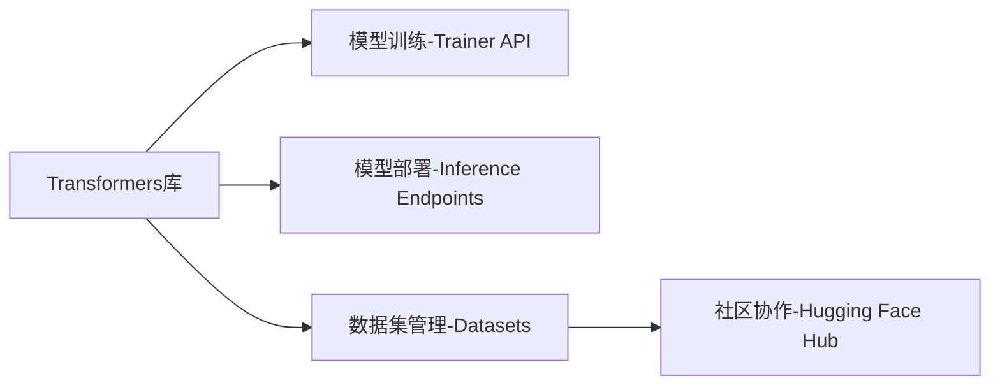
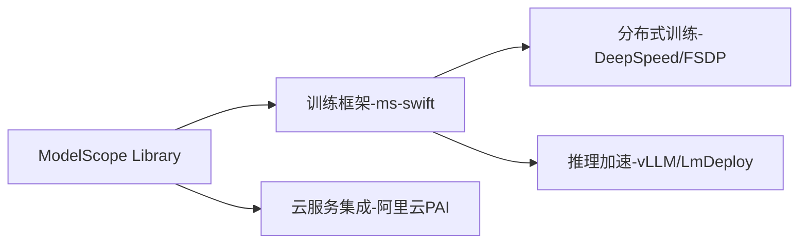

Hugging Face 和 ModelScope 是当前人工智能领域两大重要的开源模型平台，它们在推动模型共享、开发与应用方面扮演着关键角色，但在定位、技术生态和应用场景上存在显著差异：

---

### 🧠 **一、核心定位与背景**
| **特性**               | **Hugging Face**                              | **ModelScope**                              |
|------------------------|----------------------------------------------|---------------------------------------------|
| **开发方**             | 美国独立开源公司                             | 中国阿里巴巴集团                            |
| **成立时间**           | 2016 年                                      | 2022 年                                     |
| **核心目标**           | 构建全球最大开源模型社区，推动 AI 民主化     | 提供一站式模型服务（MaaS），降低中文场景 AI 使用门槛 |
| **技术侧重**           | NLP 起家，逐步扩展至多模态                   | 全领域覆盖（NLP/CV/语音/科学计算等）         |
| **开源程度**           | 完全开放，社区驱动                           | 开源为主，部分企业级功能需阿里云集成         |

---

### ⚙️ **二、核心功能对比**
#### **1. 模型生态**
- **Hugging Face**  
  - **模型库**：托管超 50 万个模型（如 Llama、Stable Diffusion），覆盖文本、图像、音频等多模态任务。  
  - **特色工具**：  
    - `Transformers` 库：标准化模型调用接口（PyTorch/TensorFlow）。  
    - `Trainer API`：简化训练流程，支持混合精度训练、分布式训练等高级功能。  
    - `Spaces`：提供模型在线演示环境（如 AI 换装、视频生成）。  

- **ModelScope**  
  - **模型库**：聚焦中文场景，提供超 600 个预训练模型（如通义千问、视觉大模型）。  
  - **特色工具**：  
    - `ms-swift` 框架：支持模型微调（LoRA/QLoRA）、量化、RLHF 全流程开发。  
    - **企业级服务**：集成阿里云算力，支持大规模模型训练与部署。  

#### **2. 开发体验**
- **Hugging Face**  
  - 强项：国际化社区活跃，文档完善，适合快速原型验证。  
  - 典型用例：通过 `Pipeline` API 三行代码调用文本生成模型。  
- **ModelScope**  
  - 强项：中文文档丰富，提供 **AgentScope** 等多智能体开发框架，适合企业级应用编排。  
  - 典型用例：使用 `ms-swift` 在单卡上 10 分钟微调 Qwen 模型。  

---

### 🌐 **三、技术架构差异**
#### **Hugging Face 技术栈**

- **优势**：标准化程度高，生态工具链完整（如评估库 `Evaluate`、可视化工具 `Gradio`）。  

#### **ModelScope 技术栈**

- **优势**：深度优化中文场景，支持 **昇腾 NPU** 国产硬件适配。  

---

### 🚀 **四、典型应用场景**
#### **Hugging Face 适用领域**
- **快速原型开发**：例如用 `Stable Diffusion` 生成营销图片。  
- **学术研究**：复现最新论文模型（如 LLaMA-3）。  
- **跨国团队协作**：通过 Spaces 共享多语言对话机器人。  

#### **ModelScope 适用领域**
- **中文业务落地**：  
  - 金融：通义千问合同审核系统。  
  - 电商：多模态商品描述生成。  
- **政企私有化部署**：通过阿里云专有云满足数据合规需求。  

---

### 🔍 **五、平台选择建议**
| **需求场景**               | **推荐平台**      | **理由**                                                                 |
|----------------------------|------------------|--------------------------------------------------------------------------|
| 国际化项目/最新模型实验    | Hugging Face     | 模型更新快，社区支持广，生态工具成熟                                     |
| 中文业务/企业级生产环境    | ModelScope       | 中文优化深，阿里云集成紧密，符合国内数据合规要求                         |
| 多智能体系统开发           | ModelScope       | AgentScope 框架提供分布式 Actor 模型，简化复杂 Agent 编排     |
| 教育/低成本入门            | Hugging Face     | 免费资源多，Colab 教程丰富                                               |

---

### 💡 **六、发展趋势**
- **Hugging Face**：向 **AI 全栈平台** 演进，整合模型开发、评估、部署全链路（如推出 **Inference Endpoints** 托管服务）。  
- **ModelScope**：强化 **垂直行业解决方案**，如医疗模型（阿里健康）、工业质检（通义工业）。  

> 两者均代表了开源模型平台的先进方向，开发者常组合使用——例如用 Hugging Face 做前沿实验，ModelScope 实现中文业务落地。